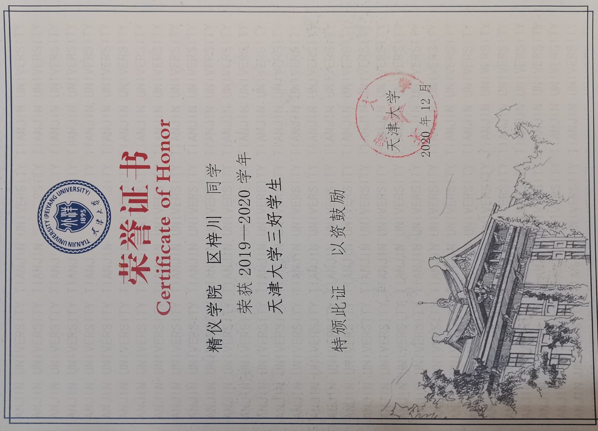
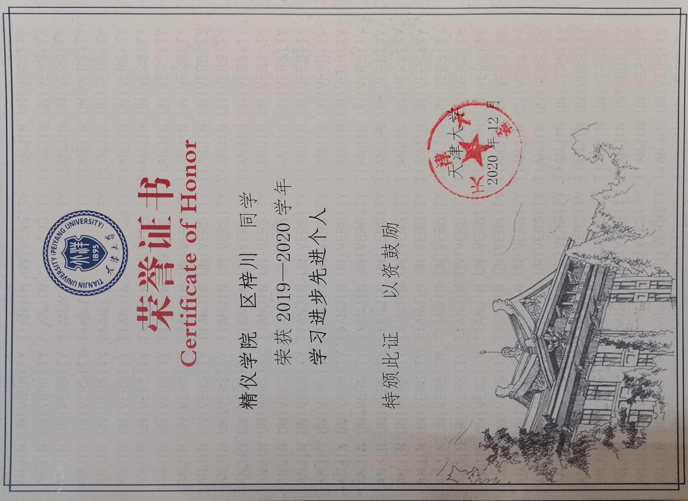
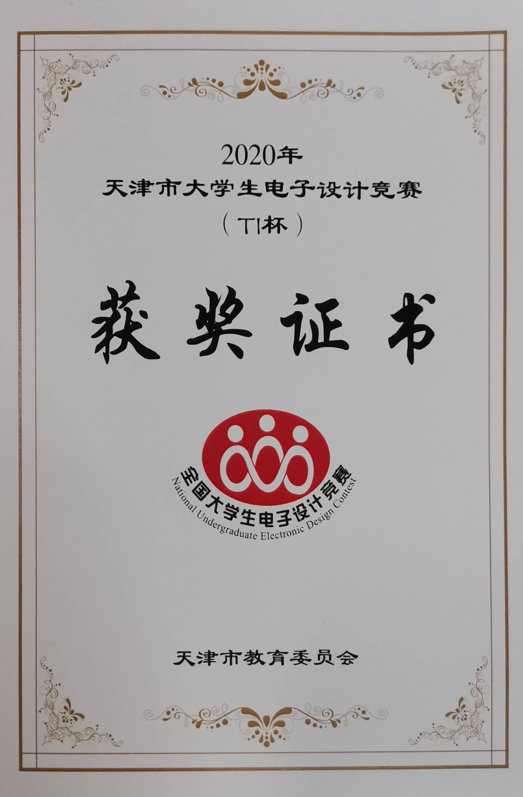
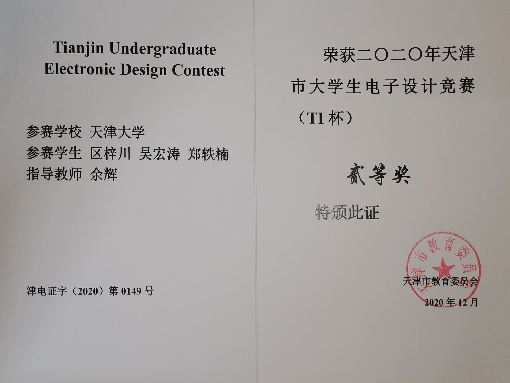
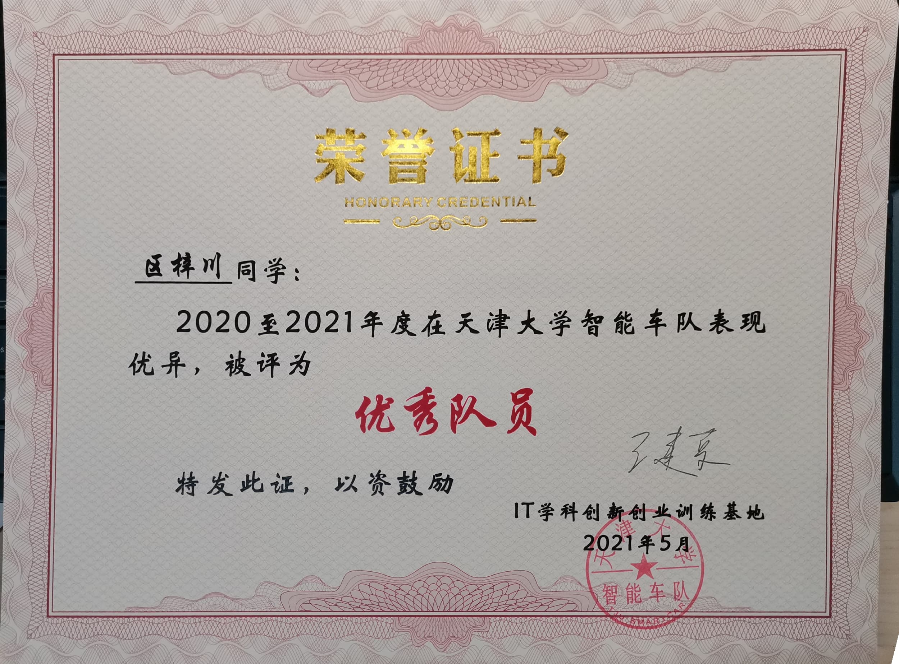
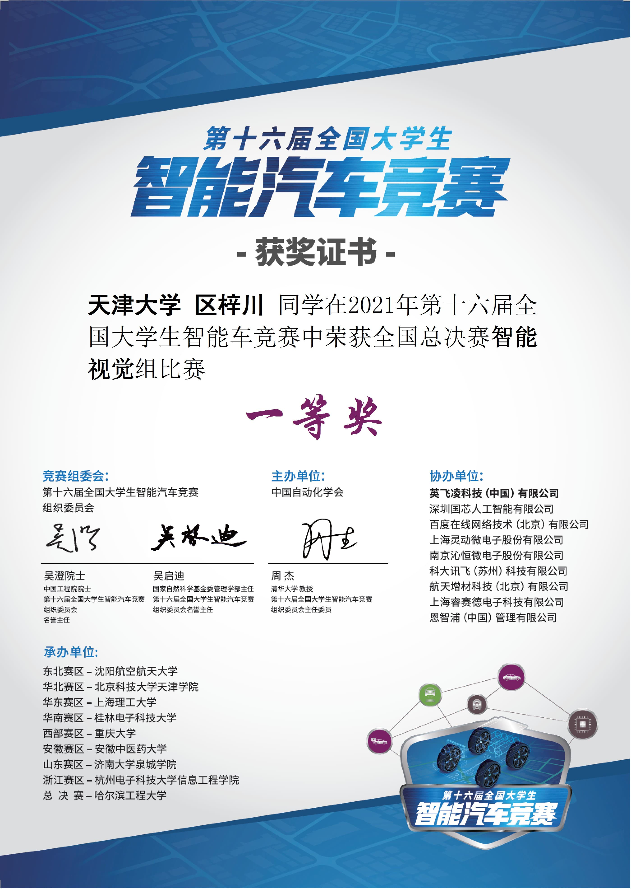
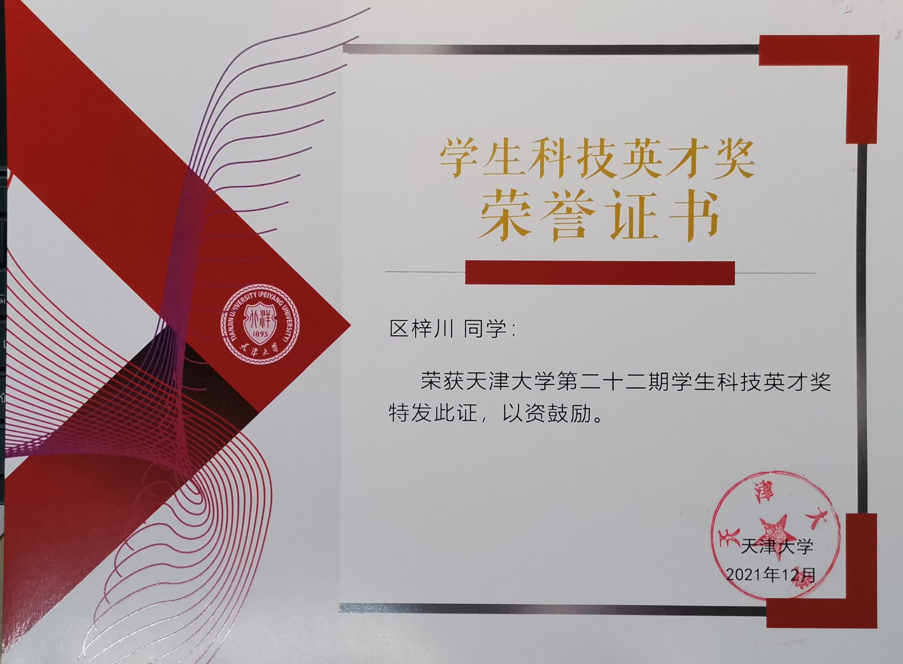
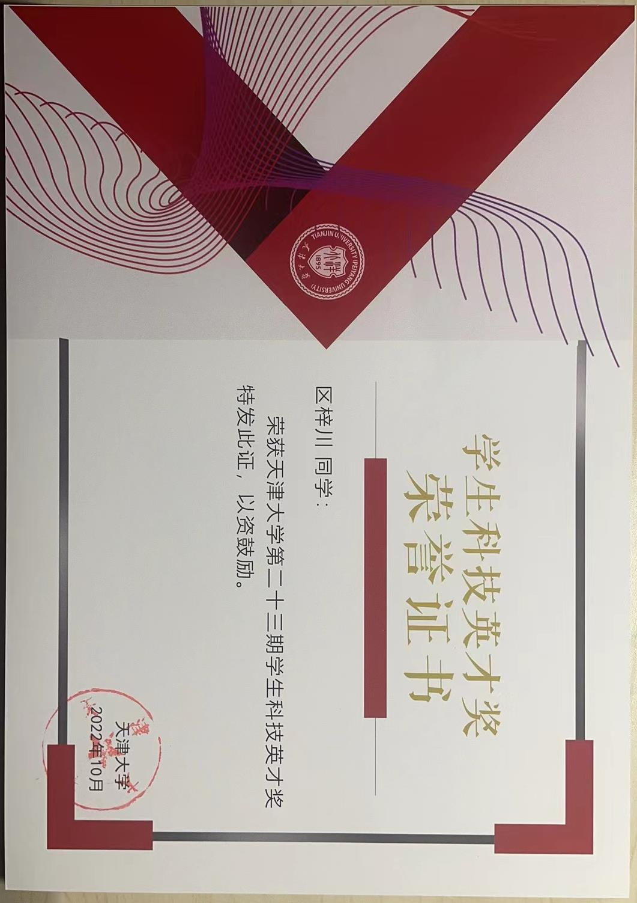

  
 <!-- **Dec. 2020:** Merit student in TJU

 **Dec. 2020:** Advanced individual in Learning Progress

 **Dec. 2020:** `2nd Prize` in Tianjin, TI Cup National Undergraduate Electronics Design Contest

  
  

 **May. 2021:** Merit team member in TJU smart-car Lab

 **Jul. 2021:** `1st Prize` in North China region The National University Students intelligent Car Race

 **Aug. 2021:** `1st Prize` in national finals, The National University Students intelligent Car Race

 **Dec. 2021:** Science & Technology excellence award

 **Dec. 2021:** `1st Prize` in national finals, TI Cup National Undergraduate Electronics Design Contest

  
  

 **Oct. 2022:** Science & Technology excellence award

   -->
