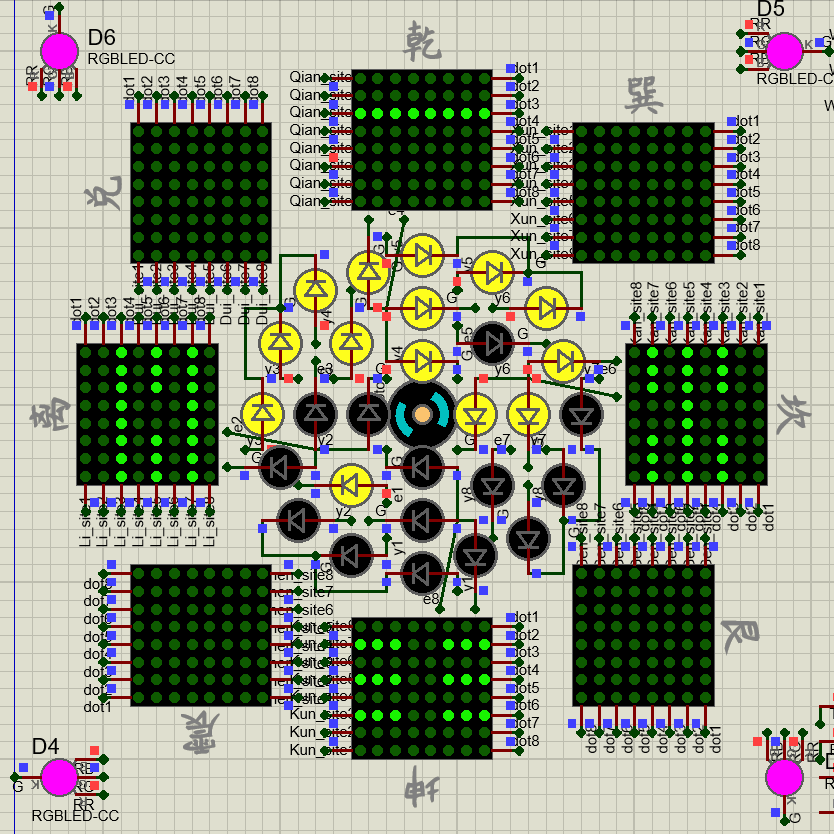

# Zichuan Ou

I am currently a student at `Tianjin University`, Major in `Measurement and Control Technology and Instrument`. I am interested in Embeded system, AI, Robotics, Autonomous. 

# My awards

- Advanced individual in Learning Progress 
- Merit student in TJU
- Merit team member in TJU smart-car Lab
- Science & Technology excellence award
- `2nd Prize` in Tianjin, TI Cup National Undergraduate Electronics Design Contest
- `1st Prize` in North China region The National University Students intelligent Car Race
- `1st Prize` in national finals, The National University Students intelligent Car Race
- `1st Prize` in national finals, TI Cup National Undergraduate Electronics Design Contest

    

        
    

    

        
        
    

    

        
    

    

        
    

  

    

        <iframe src="https://player.bilibili.com/player.html?bvid=BV1tL4y1T7xn&page=1" scrolling="no" border="0" frameborder="no" framespacing="0" allowfullscreen="true"> </iframe>
    

    

        <iframe src="https://player.bilibili.com/player.html?bvid=BV13L411K7ex&page=1" scrolling="no" border="0" frameborder="no" framespacing="0" allowfullscreen="true"> </iframe>  </body>
    

# my working experience

- TI cup: Contactless temperature measurement & identification device
- Smart car - AI vision track
- TI cup: Intelligent drug delivery car
- Embedded software intern in [Unity-Drive](https://www.unity-drive.com/index.html) for 8 months

# my pages

  <a href="https://blog.csdn.net/weixin_46143152?type=blog" target="_blank">
    

      

        

          <h2>小电动车</h2>
        

        
        
      

      

        

          
访问：103,134

          
文章：115

          
关注：259

        

      

    

  </a>

  <a href="https://mp.weixin.qq.com/s?__biz=MzIzMjUzODU5NQ==&mid=2247484596&idx=1&sn=a6222d74b122a2ef72d7f87ddfbf08c6&chksm=e8922c38dfe5a52e2a30e62df7f695d1518b12b9f88d00f8fc6fcd2f914d27a91a33f8f662ab#rd" target="_blank">
    

      

        

          <h2>小电动车</h2>
        

        
        
      

      

        

          
原创：8

          
关注：871

        

      

    

  </a>

  <a href="https://github.com/ouzhoucheng" target="_blank">
    

      

        

          <h2>ouzhoucheng</h2>
        

        
        
      

      

        

          
Repositories:16

          
following:15

        

      

    

  </a>

